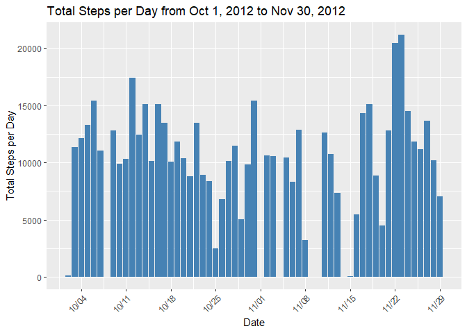
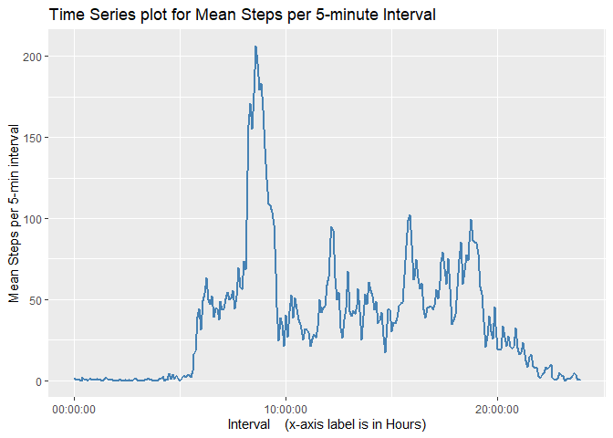
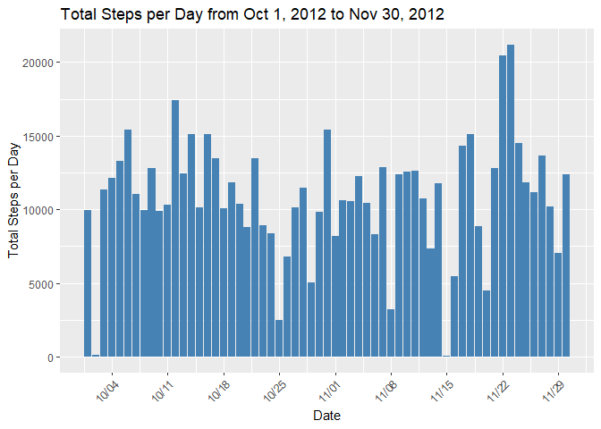
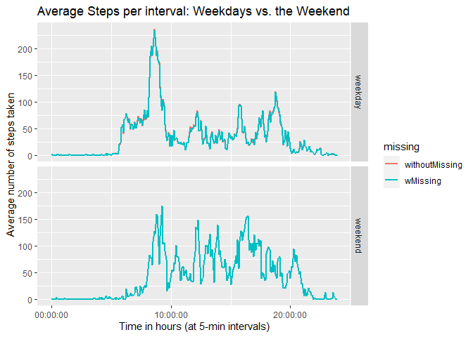

### Project 1: Data Analysis from an activity monitoring device

In this project, we focus on understanding the data generated from an activity monitoring device regarding the number of steps taken in 5-minute intervals. The analysis helps us understand the activity levels of the user as a function of time.

## Loading and preprocessing the data


```r
# Set the URL of the zip file
url <- "https://github.com/rdpeng/RepData_PeerAssessment1/raw/master/activity.zip"

# Set the destination file name
destfile <- "activity.zip"

# Download the zip file
download.file(url, destfile, quiet = TRUE)

# Extract the activity.csv file
unzip(destfile, "activity.csv")

# Load the data into R
mydat <- read.csv("activity.csv")
```


### Initial Exploratory Data Analysis


```r
mydat %>% head()
```

```
##   steps       date interval
## 1    NA 2012-10-01        0
## 2    NA 2012-10-01        5
## 3    NA 2012-10-01       10
## 4    NA 2012-10-01       15
## 5    NA 2012-10-01       20
## 6    NA 2012-10-01       25
```


- Initial glimpse of the data


```r
mydat %>% glimpse
```

```
## Rows: 17,568
## Columns: 3
## $ steps    <int> NA, NA, NA, NA, NA, NA, NA, NA, NA, NA, NA, NA, NA, NA, NA, N…
## $ date     <chr> "2012-10-01", "2012-10-01", "2012-10-01", "2012-10-01", "2012…
## $ interval <int> 0, 5, 10, 15, 20, 25, 30, 35, 40, 45, 50, 55, 100, 105, 110, …
```

- NA values per column:

All missing values are associated with the steps column.


```r
mydat %>% is.na() %>% colSums()
```

```
##    steps     date interval 
##     2304        0        0
```


- Determining the number of unique values per column.

  - there are 61 unique dates
  - there are 288 unique intervals (5-minute periods)


```r
for (i in 1:3){
  print(mydat %>% select(all_of(i)) %>% unique() %>% nrow())
}
```

```
## [1] 618
## [1] 61
## [1] 288
```

- How are the missing values distributed?

Reshaping the data, looks like the missing values are all on specific dates.


```r
mydat %>% 
      pivot_wider(names_from = interval, values_from = steps) %>%
      is.na() %>% 
      rowSums()
```

```
##  [1] 288   0   0   0   0   0   0 288   0   0   0   0   0   0   0   0   0   0   0
## [20]   0   0   0   0   0   0   0   0   0   0   0   0 288   0   0 288   0   0   0
## [39]   0 288 288   0   0   0 288   0   0   0   0   0   0   0   0   0   0   0   0
## [58]   0   0   0 288
```

- Determining where the missing values are located.

Of the 2304 missing values for the steps column, it turns out that they are not scattered throughout the data, but the missing data are all on 8 specific days (288*8 = 2304 missing vals). The missing days are identified in the code chunk below.

- Specific dates with missing values are shown below.


```r
mydata <- mydat %>% 
      pivot_wider(names_from = interval, values_from = steps) %>% 
      mutate(missingvals = rowSums(is.na(.))) %>% 
      select(date, missingvals)
mydata %>% filter(missingvals > 0)
```

```
## # A tibble: 8 × 2
##   date       missingvals
##   <chr>            <dbl>
## 1 2012-10-01         288
## 2 2012-10-08         288
## 3 2012-11-01         288
## 4 2012-11-04         288
## 5 2012-11-09         288
## 6 2012-11-10         288
## 7 2012-11-14         288
## 8 2012-11-30         288
```


## Q1: What is mean total number of steps taken per day?

#### 1.1 Calculate the total number of steps taken per day

Total steps per day can be calculated by grouping the steps by date and getting the sum for each day.

We notice that there are some days where totalsteps cannot be calculated due to missing values.


```r
# use this
TotalSteps_perDay <- mydat %>% 
      group_by(date) %>% 
      summarize(total_steps = sum(steps)) %>% 
      mutate(date = as.Date(date))
TotalSteps_perDay %>% head()
```

```
## # A tibble: 6 × 2
##   date       total_steps
##   <date>           <int>
## 1 2012-10-01          NA
## 2 2012-10-02         126
## 3 2012-10-03       11352
## 4 2012-10-04       12116
## 5 2012-10-05       13294
## 6 2012-10-06       15420
```


#### 1.2 histogram of the total number of steps taken each day

Total steps per day are plotted as follows. Since we don't have data for some of the days, there are gaps in the histogram for those days.


```r
# use this
TotalSteps_perDay %>% 
      ggplot(aes(date, total_steps)) + 
      geom_histogram(stat = 'identity', fill = 'steelblue') +
      labs(x = "Date", y = "Total Steps per Day") +
      scale_x_date(date_labels = "%m/%d", date_breaks = "7 days") +
      theme(axis.text.x = element_text(angle = 45, hjust=1)) + 
      ggtitle("Total Steps per Day from Oct 1, 2012 to Nov 30, 2012")
```

<!-- -->


#### 1.3 mean and median of the total number of steps taken per day


```r
# use this
TotalSteps_perDay %>% 
      summarize(meansteps = mean(total_steps, na.rm = TRUE), 
                mediansteps = median(total_steps, na.rm = TRUE))
```

```
## # A tibble: 1 × 2
##   meansteps mediansteps
##       <dbl>       <int>
## 1    10766.       10765
```


## Q2. What is the average daily activity pattern?

#### Q2.1 Make a time series plot of the 5-minute interval (x-axis) and the average number of steps taken, averaged across all days (y-axis)


For identifying the average daily activity pattern, we need to look at the average activity (average number of steps across all days) for each 5-minute interval.

For plotting the time series of the 5-min intervals and the average number of steps, it is helpful to arrange the data differently.


```r
mydat2 <- mydat %>% 
      pivot_wider(names_from = date, values_from = steps)
mydat2 %>% head()
```

```
## # A tibble: 6 × 62
##   interval `2012-10-01` `2012-10-02` `2012-10-03` `2012-10-04` `2012-10-05`
##      <int>        <int>        <int>        <int>        <int>        <int>
## 1        0           NA            0            0           47            0
## 2        5           NA            0            0            0            0
## 3       10           NA            0            0            0            0
## 4       15           NA            0            0            0            0
## 5       20           NA            0            0            0            0
## 6       25           NA            0            0            0            0
## # ℹ 56 more variables: `2012-10-06` <int>, `2012-10-07` <int>,
## #   `2012-10-08` <int>, `2012-10-09` <int>, `2012-10-10` <int>,
## #   `2012-10-11` <int>, `2012-10-12` <int>, `2012-10-13` <int>,
## #   `2012-10-14` <int>, `2012-10-15` <int>, `2012-10-16` <int>,
## #   `2012-10-17` <int>, `2012-10-18` <int>, `2012-10-19` <int>,
## #   `2012-10-20` <int>, `2012-10-21` <int>, `2012-10-22` <int>,
## #   `2012-10-23` <int>, `2012-10-24` <int>, `2012-10-25` <int>, …
```

Taking the row means while leaving out the interval column gives the desired output. Also, we create a function to convert the interval to time units, and use this function to update the datatype of the interval column.


```r
# function to convert interval to time units
tohours_3 <- function(data){
  hour = floor(data/100)
  min = sprintf("%02d", data %% 100)
  time_str = parse_time(paste0(hour, ":", min))
  return (time_str)
}
```


```r
# getting our dataframe with the mean steps per interval
mydat2_intervals <- mydat2 %>% 
      mutate(interval_means = round(rowMeans(select(.,-interval), 
                                             na.rm = TRUE), 2)) %>% 
      select(interval, interval_means) %>% 
      mutate(interval = tohours_3(interval))
mydat2_intervals %>% head()
```

```
## # A tibble: 6 × 2
##   interval interval_means
##   <time>            <dbl>
## 1 00'00"             1.72
## 2 05'00"             0.34
## 3 10'00"             0.13
## 4 15'00"             0.15
## 5 20'00"             0.08
## 6 25'00"             2.09
```
Finally, the time series plot is obtained as follows with the above dataframe.


```r
mydat2_intervals %>% 
  ggplot(aes(x = interval, y = interval_means)) + 
  geom_line(lwd = 1, color = "steelblue") +
  labs(x = "Interval    (x-axis label is in Hours)", 
       y = "Mean Steps per 5-min interval") +
  ggtitle("Time Series plot for Mean Steps per 5-minute Interval")
```

<!-- -->


#### Q2.2 Which 5-minute interval on average contains the maximum number of steps?

Based on the code below, 8:35AM is associated with the maximum number of steps, based on daily average number of steps.


```r
mydat2_intervals %>% 
      filter(interval_means == max(interval_means))
```

```
## # A tibble: 1 × 2
##   interval interval_means
##   <time>            <dbl>
## 1 08:35              206.
```


## Q3. Imputing missing values


#### 3.1  Total number of missing values in the dataset (i.e. the total number of rows with NAs)

It is seen that only missing values (NAs) are in the steps column.


```r
mydat %>% is.na() %>% colSums()
```

```
##    steps     date interval 
##     2304        0        0
```

Further, all of these missing values (288*8 = 2304) are consolidated to specific dates, as shown below.


```r
mydata <- mydat %>% 
      pivot_wider(names_from = interval, values_from = steps) %>% 
      mutate(missingvals = rowSums(is.na(.))) %>% 
      select(date, missingvals)
mydata %>% filter(missingvals > 0)
```

```
## # A tibble: 8 × 2
##   date       missingvals
##   <chr>            <dbl>
## 1 2012-10-01         288
## 2 2012-10-08         288
## 3 2012-11-01         288
## 4 2012-11-04         288
## 5 2012-11-09         288
## 6 2012-11-10         288
## 7 2012-11-14         288
## 8 2012-11-30         288
```


#### 3.2 Devise a strategy for filling in all of the missing values in the dataset. 

$Strategy$

- Each of the missing values correspond to a specific interval and a specific day of week.

- It can be envisioned that the missing values for the steps taken for a particular 5min interval could be approximated reasonably well if we use the mean steps for 
      - the same day of the week, AND 
      - the same 5-minute interval combinations.

- It is expected that the missing value will have substantial similarity to the values corresponding to the same time of the day and the same day of the week. 

- Therefore, the strategy is to create a dataframe with the means of each weekday and interval combinations, and then use these values to impute the missing values corresponding to the same weekday and interval combinations.

#### 3.3  Create a new dataset that is equal to the original dataset but with the missing data filled in.


#### Implementation of Strategy

To accomplish this, we first build the dataframe imputedf, which is the dataframe we are going to impute from. For this, from the original data, we convert the dates to weekdays, group by weekday and interval, and get the corresponding means.


```r
imputedf <- mydat %>% 
      mutate(interval = tohours_3(interval)) %>% 
      mutate(wkday = weekdays(as.Date(date))) %>% 
      select(-date) %>% group_by(wkday, interval) %>% 
      summarize(mean_steps = round(mean(steps, na.rm = TRUE), 2))
imputedf %>% head()
```

```
## # A tibble: 6 × 3
## # Groups:   wkday [1]
##   wkday  interval mean_steps
##   <chr>  <time>        <dbl>
## 1 Friday 00'00"            0
## 2 Friday 05'00"            0
## 3 Friday 10'00"            0
## 4 Friday 15'00"            0
## 5 Friday 20'00"            0
## 6 Friday 25'00"            0
```

For each combination of wkday and interval, we have an associated mean, mean_steps. An example is shown below:


```r
imputedf %>% 
      filter(interval == 00:00:00 & wkday == 'Monday')
```

```
## # A tibble: 1 × 3
## # Groups:   wkday [1]
##   wkday  interval mean_steps
##   <chr>  <time>        <dbl>
## 1 Monday 00'00"         1.43
```

For the dataframe we are going to impute missing values for, we add a weekday column, so that we can join by weekday and interval.


```r
mydata3 <- mydat %>% 
      mutate(interval = tohours_3(interval)) %>% 
      mutate(wkday = weekdays(as.Date(date)))
mydata3 %>% head()
```

```
##   steps       date interval  wkday
## 1    NA 2012-10-01 00:00:00 Monday
## 2    NA 2012-10-01 00:05:00 Monday
## 3    NA 2012-10-01 00:10:00 Monday
## 4    NA 2012-10-01 00:15:00 Monday
## 5    NA 2012-10-01 00:20:00 Monday
## 6    NA 2012-10-01 00:25:00 Monday
```

And finally,  

- imputedf is left-joined with mydata3:
      - making sure only those with missing values are imputed
      - interval and wkday columns match up (by = c('interval', 'wkday'))
- missing values are imputed using values from the mean_steps column
- the mean_steps and wkday columns are dropped to get back our imputed dataframe

The imputed new dataset is 'mydata3_imputed'


```r
mydata3_imputed <- mydata3 %>% 
      left_join(imputedf, by = c('interval', 'wkday')) %>% 
      mutate(steps = if_else(is.na(steps), mean_steps, steps)) %>% 
      select(-mean_steps, -wkday)
mydata3_imputed %>% head()
```

```
##   steps       date interval
## 1  1.43 2012-10-01 00:00:00
## 2  0.00 2012-10-01 00:05:00
## 3  0.00 2012-10-01 00:10:00
## 4  0.00 2012-10-01 00:15:00
## 5  0.00 2012-10-01 00:20:00
## 6  5.00 2012-10-01 00:25:00
```
At the end of the imputation, we are left with zero missing values.


```r
mydata3_imputed %>% is.na() %>% colSums()
```

```
##    steps     date interval 
##        0        0        0
```


#### 3.4.1 Make a histogram of the total number of steps taken each day


The total number of steps taken per day can be plotted using our imputed data frame as follows:


```r
mydata3_imputed %>% 
      mutate(date = as.Date(date)) %>% 
      group_by(date) %>% 
      summarize(steps_perday = sum(steps)) %>% 
      ggplot(aes(date, steps_perday)) +
      geom_histogram(stat = "identity", fill = "steelblue") +
      labs(x = "Date", y = "Total Steps per Day") +
      scale_x_date(date_labels = "%m/%d", date_breaks = "7 days") +
      theme(axis.text.x = element_text(angle = 45, hjust=1)) + 
      ggtitle("Total Steps per Day from Oct 1, 2012 to Nov 30, 2012")
```

<!-- -->


#### 3.4.2  Calculation of the mean and median total number of steps taken per day


To find this, we write a function that groups the data by date and calculates the total steps taken per day. We then summarize with the mean and median total steps.


```r
perday_meansmedians <- function(data){
      updateddata = data %>% 
            group_by(date) %>% 
            summarize(total_steps = sum(steps)) %>%
            summarize(mean_totalsteps = mean(total_steps, na.rm = TRUE),
                      median_totalsteps = median(total_steps, na.rm = TRUE))
      return (updateddata)
}
```

Applying this function to the imputed dataframe:


```r
perday_meansmedians(mydata3_imputed)
```

```
## # A tibble: 1 × 2
##   mean_totalsteps median_totalsteps
##             <dbl>             <dbl>
## 1          10821.             11015
```
And applying this to the original dataframe:


```r
perday_meansmedians(mydat)
```

```
## # A tibble: 1 × 2
##   mean_totalsteps median_totalsteps
##             <dbl>             <int>
## 1          10766.             10765
```


#### 3.4.3 Do these values differ from the estimates from the first part of the assignment? 

Yes, there is a small difference in the means and the medians, between the imputed and the original data, regarding the total steps taken per day.

With the original data, when we summed the daily steps, since eight of the days were missing steps data, we had NAs for some of the sums. In calculating the means and the medians, we had to remove the NA values.

In contrast, with the imputed data frame, those 8 days have the imputed data, which involves approximations. The means and medians are then calculated with the full data including the imputations.

Thus, there is a difference in the mean and the median calculations with the imputed data, compared to the first part of the assignment. But the differences are small.


#### 3.4.4 What is the impact of imputing missing data on the estimates of the total daily number of steps?

Since the missing values are not scattered throughout the dataframe but are concentrated on specific days, the total daily steps only change for the days which had missing values, since an imputation is involved. For the remaining days which had no missing values, the total daily steps remain the same, as shown below.


```r
# total steps, with imputations
imputed_totaldailysteps <- mydata3_imputed %>% 
      group_by(date) %>% 
      summarize(totalsteps_imputed = sum(steps))
```


```r
# total steps - original
original_totaldailysteps <- mydat %>% 
      group_by(date) %>% 
      summarize(totalsteps_original = sum(steps))
```

A comparison of the first 6 rows are shown to demonstrate this.


```r
imputed_totaldailysteps %>% 
      left_join(original_totaldailysteps, by = 'date') %>% head()
```

```
## # A tibble: 6 × 3
##   date       totalsteps_imputed totalsteps_original
##   <chr>                   <dbl>               <int>
## 1 2012-10-01              9975.                  NA
## 2 2012-10-02               126                  126
## 3 2012-10-03             11352                11352
## 4 2012-10-04             12116                12116
## 5 2012-10-05             13294                13294
## 6 2012-10-06             15420                15420
```


## Q4: Are there differences in activity patterns between weekdays and weekends?

#### 4.1 Create a new factor variable in the dataset with two levels – “weekday” and “weekend”

Below, we create the factor variable with the original data as well as the imputed data from the earlier steps.


```r
# with original data
mydata4 <- mydat %>% 
      mutate(dayofweek = weekdays(as.Date(date))) %>% 
      mutate(wknd = as.factor(
            if_else(dayofweek %in% c('Saturday',  'Sunday'), 
                    'weekend',
                    'weekday')))
mydata4 %>% head()
```

```
##   steps       date interval dayofweek    wknd
## 1    NA 2012-10-01        0    Monday weekday
## 2    NA 2012-10-01        5    Monday weekday
## 3    NA 2012-10-01       10    Monday weekday
## 4    NA 2012-10-01       15    Monday weekday
## 5    NA 2012-10-01       20    Monday weekday
## 6    NA 2012-10-01       25    Monday weekday
```


```r
# with imputed data
mydata5 <- mydata3_imputed %>% 
      mutate(dayofweek = weekdays(as.Date(date))) %>% 
      mutate(wknd = as.factor(
            if_else(dayofweek %in% c('Saturday',  'Sunday'), 
                    'weekend',
                    'weekday')))
mydata5 %>% head()
```

```
##   steps       date interval dayofweek    wknd
## 1  1.43 2012-10-01 00:00:00    Monday weekday
## 2  0.00 2012-10-01 00:05:00    Monday weekday
## 3  0.00 2012-10-01 00:10:00    Monday weekday
## 4  0.00 2012-10-01 00:15:00    Monday weekday
## 5  0.00 2012-10-01 00:20:00    Monday weekday
## 6  5.00 2012-10-01 00:25:00    Monday weekday
```


#### 4.2 Make a panel plot containing a time series plot of the 5-minute interval (x-axis) and the average number of steps taken, averaged across all weekday days or weekend days (y-axis).


- To make the panel plots, we create two dataframes that show whether it is a weekday or a weekend, and the intervals, and corresponding mean steps for each.

- We do this with both the imputed data (without_missing) and the unimputed data (with_missing).

- Next, we left join to get the full dataframe.


```r
with_missing <- mydata4 %>% 
      mutate(interval = tohours_3(interval)) %>% 
      group_by(interval, wknd) %>% 
      summarize(wMissing = round(mean(steps, na.rm = TRUE), 2))
without_missing <- mydata5 %>% 
      #mutate(interval = tohours_3(interval)) %>% 
      group_by(wknd, interval) %>% 
      summarize(withoutMissing = round(mean(steps, na.rm = TRUE), 2))
# using left join to have all the data in the same dataframe
fulldata <- with_missing %>% 
      left_join(without_missing, by = c('interval', 'wknd')) %>% 
      pivot_longer(3:4, names_to = 'missing', 
                   values_to = 'mean_vals') %>% 
      mutate(missing = as.factor(missing))

fulldata %>% head()
```

```
## # A tibble: 6 × 4
## # Groups:   interval [2]
##   interval wknd    missing        mean_vals
##   <time>   <fct>   <fct>              <dbl>
## 1 00'00"   weekday wMissing            2.33
## 2 00'00"   weekday withoutMissing      2.31
## 3 00'00"   weekend wMissing            0   
## 4 00'00"   weekend withoutMissing      0   
## 5 05'00"   weekday wMissing            0.46
## 6 05'00"   weekday withoutMissing      0.45
```
Next, we make a panel plot with fulldata, the two panels representing the mean steps per interval on weekdays vs. on the weekends. 

In each of the plots, the imputed data is plotted in red, and the original data in green.


```r
fulldata %>% 
      ggplot(aes(interval, mean_vals, color = missing)) +
      geom_line(lwd = 1) +
      facet_grid(wknd~.) +
      labs(x = "Time in hours (at 5-min intervals)",
           y = "Average number of steps taken") +
      ggtitle("Average Steps per interval: Weekdays vs. the Weekend")
```

<!-- -->


#### Differences between activity patterns during weekdays vs the weekends

Going through this data and making plots gave us an idea regarding the mean steps during weekday and weekends, at various hours.

  - Interestingly, imputation only made a slight difference in the number of steps taken during the weekday and negligible difference for the weekend, as seen by the near overlap of the red line representing with imputations and the blue line representing without imputations. The slight difference may be an indication that our imputation strategy is working well.
  - It looks like the activity during 8-9AM is much higher during weekdays, which is probably consistent with people going to work during these hours.
  - The mean activity between 10AM and 4PM appears to be higher during the weekends, consistent with people being out and about during the weekend instead of being at work during weekdays.
  - During the weekends, people seem to be more active in the evenings after 8PM, consistent with people staying up late during weekends.
  - From 5-8AM, and 4-6PM, there is considerably more activity during the week compared to weekends; this could be due to people getting ready to go to work or getting their exercise in the mornings/evenings, while more people are probably likely to sleep in during the weekend mornings.


