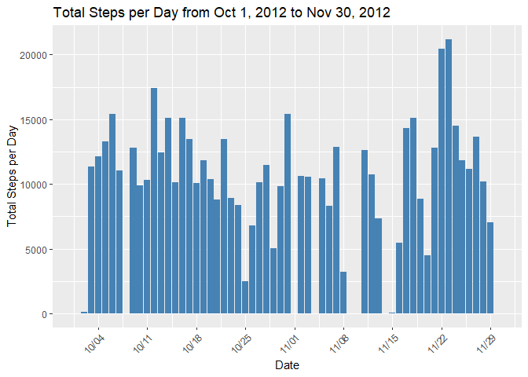
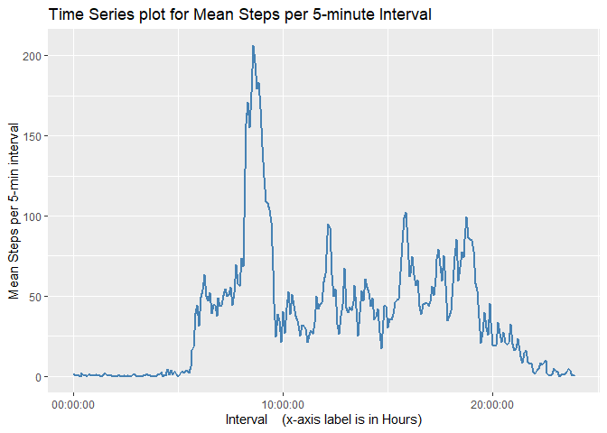
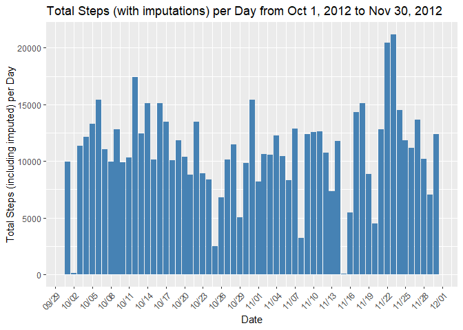
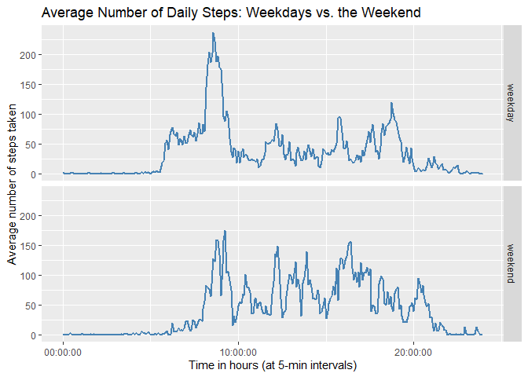

## 1. Loading and preprocessing the data


```r
# Set the URL of the zip file
url <- "https://github.com/rdpeng/RepData_PeerAssessment1/raw/master/activity.zip"

# Set the destination file name
destfile <- "activity.zip"

# Download the zip file
download.file(url, destfile, quiet = TRUE)

# Extract the activity.csv file
unzip(destfile, "activity.csv")

# Load the data into R
mydat <- read.csv("activity.csv")
```


```r
mydat %>% head()
```

```
##   steps       date interval
## 1    NA 2012-10-01        0
## 2    NA 2012-10-01        5
## 3    NA 2012-10-01       10
## 4    NA 2012-10-01       15
## 5    NA 2012-10-01       20
## 6    NA 2012-10-01       25
```


### 1.1 Initial Exploratory Data Analysis

- Initial glimpse of the data


```r
mydat %>% glimpse
```

```
## Rows: 17,568
## Columns: 3
## $ steps    <int> NA, NA, NA, NA, NA, NA, NA, NA, NA, NA, NA, NA, NA, NA, NA, N…
## $ date     <chr> "2012-10-01", "2012-10-01", "2012-10-01", "2012-10-01", "2012…
## $ interval <int> 0, 5, 10, 15, 20, 25, 30, 35, 40, 45, 50, 55, 100, 105, 110, …
```

- NA values per column:


```r
mydat %>% is.na() %>% colSums()
```

```
##    steps     date interval 
##     2304        0        0
```

- Determining the number of unique values per column.

  - there are 61 unique dates
  - there are 288 unique intervals (5-minute periods)


```r
for (i in 1:3){
  print(mydat %>% select(all_of(i)) %>% unique() %>% nrow())
}
```

```
## [1] 618
## [1] 61
## [1] 288
```

- Determining where the missing values are located.

Of the 2304 missing values for the steps column, it turns out that they are not scattered throughout the data, but the missing data are all on 8 specific days (288*8 = 2304 missing vals). The missing days are identified in the code chunk below.


```r
missing_days <- mydat %>% 
  pivot_wider(names_from = interval, values_from = steps) %>% 
  mutate(missing_vals_perday = rowSums(is.na(.))) %>% 
  select(date, missing_vals_perday, everything()) %>% 
  filter(missing_vals_perday != 0)
```

  - The days for which we have NAs are displayed in missing_days$date below.


```r
missing_days$date
```

```
## [1] "2012-10-01" "2012-10-08" "2012-11-01" "2012-11-04" "2012-11-09"
## [6] "2012-11-10" "2012-11-14" "2012-11-30"
```


## Q1: What is mean total number of steps taken per day?

#### 1.1 Calculate the total number of steps taken per day

There are 61 days total for this data. But per the initial EDA, 8 days of data are fully missing (variable: missing_days), and there are actually 53 days of data.

So number of days can be 61 including the missing days, or 53 excluding the missing days.

Total number of steps is 570608.


```r
total_steps <- mydat$steps %>% sum(na.rm = TRUE)
total_steps
```

```
## [1] 570608
```

- Total steps per day are as follows. The NAs correspond to the days for which data are missing.
  

```r
TotalSteps_perDay <- mydat %>% 
  pivot_wider(names_from = interval, values_from = steps) %>% 
  mutate(date = as.Date(date), steps_perday = rowSums(select(., -date))) %>% 
  select(date, steps_perday)
TotalSteps_perDay %>% head()
```

```
## # A tibble: 6 × 2
##   date       steps_perday
##   <date>            <dbl>
## 1 2012-10-01           NA
## 2 2012-10-02          126
## 3 2012-10-03        11352
## 4 2012-10-04        12116
## 5 2012-10-05        13294
## 6 2012-10-06        15420
```
The mean steps per day are 10766.19.


```r
TotalSteps_perDay %>% 
  summarise(meanSteps_perDay = mean(steps_perday, na.rm = TRUE))
```

```
## # A tibble: 1 × 1
##   meanSteps_perDay
##              <dbl>
## 1           10766.
```
$Note:$

The above mean is based on 53 days, as data for the remaining days are missing. (Using number of days as 61, the mean total number of steps would be 9354.23)

#### 1.2 histogram of the total number of steps taken each day


```r
steps_eachday <- mydat %>% 
  pivot_wider(names_from = interval, values_from = steps) %>% 
  mutate(date = as.Date(date), steps_perday = rowSums(select(., -date))) %>% 
  select(date, steps_perday)
steps_eachday %>% head()
```

```
## # A tibble: 6 × 2
##   date       steps_perday
##   <date>            <dbl>
## 1 2012-10-01           NA
## 2 2012-10-02          126
## 3 2012-10-03        11352
## 4 2012-10-04        12116
## 5 2012-10-05        13294
## 6 2012-10-06        15420
```

- For the purpose of plotting the histogram, the missing values are replaced with zeros.


```r
steps_eachday %>% 
  replace_na(list(steps_perday = 0)) %>% 
  ggplot(aes(date, steps_perday)) +
  geom_histogram(stat = "identity", fill = "steelblue") +
  labs(x = "Date", y = "Total Steps per Day") +
  scale_x_date(date_labels = "%m/%d", date_breaks = "7 days") +
  theme(axis.text.x = element_text(angle = 45, hjust=1)) + 
  ggtitle("Total Steps per Day from Oct 1, 2012 to Nov 30, 2012")
```

<!-- -->


#### 1.3 mean and median of the total number of steps taken per day

Mean and median total steps per day are calculated as follows.


```r
steps_eachday %>% 
  summarize(mean_total_steps = mean(steps_perday, na.rm = TRUE),
            median_total_steps = median(steps_perday, na.rm = TRUE))
```

```
## # A tibble: 1 × 2
##   mean_total_steps median_total_steps
##              <dbl>              <dbl>
## 1           10766.              10765
```


## Q2. What is the average daily activity pattern?

#### Q2.2 Make a time series plot of the 5-minute interval (x-axis) and the average number of steps taken, averaged across all days (y-axis)

- First, we arrange the data so as to determine the mean steps per 5-min interval. The key step is to use the pivot_wider() function, followed by appropriate summarization of the relevant columns.

In determining the mean steps the division is by the number of available days of data, 53 days.


```r
# final version
meanSteps_perInterval <- mydat %>% 
  pivot_wider(names_from = date, values_from = steps) %>% 
  mutate(total_steps_5min = rowSums(select(.,-interval), na.rm = TRUE)) %>% 
  mutate(mean_steps_5min = round(total_steps_5min/53, 2)) %>% 
  select(interval, mean_steps_5min)
meanSteps_perInterval %>% head()
```

```
## # A tibble: 6 × 2
##   interval mean_steps_5min
##      <int>           <dbl>
## 1        0            1.72
## 2        5            0.34
## 3       10            0.13
## 4       15            0.15
## 5       20            0.08
## 6       25            2.09
```

- If we look at the interval column, it still shows discontinuity; for example after 55, the next number is 100. To address this, a function is created, tohours_3(), that takes in numeric data and outputs the data in period format with hours:minutes:seconds, and with the correction for discontinuity.


```r
tohours_3 <- function(data){
  hour = floor(data/100)
  min = sprintf("%02d", data %% 100)
  time_str = parse_time(paste0(hour, ":", min))
  return (time_str)
}
```


- Finally, we update the interval column with the function tohours_3() shows the appropriate intervals in time format (hms).


```r
meanSteps_per_Interval <- meanSteps_perInterval %>% 
  mutate(interval = tohours_3(interval))
meanSteps_per_Interval
```

```
## # A tibble: 288 × 2
##    interval mean_steps_5min
##    <time>             <dbl>
##  1 00'00"              1.72
##  2 05'00"              0.34
##  3 10'00"              0.13
##  4 15'00"              0.15
##  5 20'00"              0.08
##  6 25'00"              2.09
##  7 30'00"              0.53
##  8 35'00"              0.87
##  9 40'00"              0   
## 10 45'00"              1.47
## # … with 278 more rows
```


- The plot is made using ggplot2, with the x-axis hsowing the Intervals (the labels are in hours) and the y-axis shows the mean steps per 5-min interval.


```r
meanSteps_per_Interval %>% 
  ggplot(aes(x = interval, y = mean_steps_5min)) + 
  geom_line(lwd = 1, color = "steelblue") +
  labs(x = "Interval    (x-axis label is in Hours)", 
       y = "Mean Steps per 5-min interval") +
  ggtitle("Time Series plot for Mean Steps per 5-minute Interval")
```

<!-- -->


#### Q2.2 5-minute interval containing the maximum number of steps

The maximum number of steps is at 8:35AM.


```r
meanSteps_per_Interval %>% 
  filter(mean_steps_5min == max(mean_steps_5min))
```

```
## # A tibble: 1 × 2
##   interval mean_steps_5min
##   <time>             <dbl>
## 1 08:35               206.
```

## Q3. Imputing missing values


#### 3.1  Total number of missing values in the dataset (i.e. the total number of rows with NAs)

It is seen that only missing values (NAs) are in the steps column.


```r
mydat %>% is.na() %>% colSums()
```

```
##    steps     date interval 
##     2304        0        0
```


#### 3.2 Devise a strategy for filling in all of the missing values in the dataset. 

#### Strategy

- Each of the missing values correspond to an interval and a day of week.

- It is expected that the missing value will have substantial similarity to the values corresponding to the same time of the day and the same day of the week. 

- Therefore, the strategy is to identify the times and days of the missing values, and imputing these with the means of same times and days for the available data. 

- For example, if there is a missing value for 19:05 hours for a Tuesday, we shall find impute for this missing value with the mean of available data for Tuesdays for the same time/time interval, 19:05 hours.

- Therefore, our approach here would be to impute these missing values with the averages of these same weekday and interval combinations.

#### Implementation of Strategy

The above strategy is implemented in the following 5 steps.

- The averages are computed as follows.

- Step 1: The day of week is calculated


```r
mydata_days <- mydat %>% 
  mutate(dayofweek = wday(ymd(mydat$date), label = TRUE))
mydata_days %>% head()
```

```
##   steps       date interval dayofweek
## 1    NA 2012-10-01        0       Mon
## 2    NA 2012-10-01        5       Mon
## 3    NA 2012-10-01       10       Mon
## 4    NA 2012-10-01       15       Mon
## 5    NA 2012-10-01       20       Mon
## 6    NA 2012-10-01       25       Mon
```

- Step 2: We then group by dayofweek and interval, and compute the means


```r
comp_Means <- mydata_days %>% 
  group_by(dayofweek, interval) %>% 
  summarize(meanSteps = round(mean(steps, na.rm = TRUE),1))
comp_Means %>% head()
```

```
## # A tibble: 6 × 3
## # Groups:   dayofweek [1]
##   dayofweek interval meanSteps
##   <ord>        <int>     <dbl>
## 1 Sun              0       0  
## 2 Sun              5       0  
## 3 Sun             10       0  
## 4 Sun             15       0  
## 5 Sun             20       0  
## 6 Sun             25       7.4
```
- Step 3: A function is then written which looks at the computed means corresponding to the same day of week and the same 5-minute interval, and uses this value to impute the original data with the missing values.


```r
missing_imputes <- function(df_w_missing, df_w_imputes){
  for (i in 1:nrow(df_w_missing)){
    if (is.na(df_w_missing$steps[i]) == TRUE){
      valDay = df_w_missing$dayofweek[i]
      valInterval = df_w_missing$interval[i]
      df_w_missing$steps[i] = (df_w_imputes %>% 
                                 filter(dayofweek == valDay & interval == valInterval))$meanSteps
    }
  }
  return (df_w_missing)
}
```


#### 3.3  Create a new dataset that is equal to the original dataset but with the missing data filled in.

- Step 4: We use the above function to impute the missing values, and call the new dataframe imputed_df. The 'dayofweek' is the additional column in this data frame.
(this step takes a couple of minutes to run)


```r
imputed_df <- missing_imputes(mydata_days, comp_Means)
```

- Step 5: Finally, we get rid of the dayofweek column to get the full dataframe corresponding to our original data, and with the missing values imputed.


```r
imputed_df_2 <- imputed_df %>% 
  select(-dayofweek)
imputed_df_2 %>% head()
```

```
##   steps       date interval
## 1   1.4 2012-10-01        0
## 2   0.0 2012-10-01        5
## 3   0.0 2012-10-01       10
## 4   0.0 2012-10-01       15
## 5   0.0 2012-10-01       20
## 6   5.0 2012-10-01       25
```

We have now gotten rid of all of the missing values.


```r
imputed_df_2 %>% is.na() %>% colSums()
```

```
##    steps     date interval 
##        0        0        0
```


#### 3.4.1 Make a histogram of the total number of steps taken each day

- Using the exact same steps as in question 1, our new dataframe imputed_df_2 was processed, which now has the steps_perday_imputed as the column with the imputed values of steps per day.

- For the sake of clarity, the steps per day in the original data with the missing values have been added to our dataframe as steps_perday_orig.


```r
steps_eachday_imputed <- imputed_df_2 %>% 
  pivot_wider(names_from = interval, values_from = steps) %>% 
  mutate(date = as.Date(date), steps_perday_imputed = rowSums(select(., -date))) %>% 
  select(date, steps_perday_imputed) %>% 
  mutate(steps_perday_orig = steps_eachday$steps_perday)
steps_eachday_imputed %>% head()
```

```
## # A tibble: 6 × 3
##   date       steps_perday_imputed steps_perday_orig
##   <date>                    <dbl>             <dbl>
## 1 2012-10-01                9975.                NA
## 2 2012-10-02                 126                126
## 3 2012-10-03               11352              11352
## 4 2012-10-04               12116              12116
## 5 2012-10-05               13294              13294
## 6 2012-10-06               15420              15420
```
The histogram for the total number of steps taken each day is as plotted below.


```r
steps_eachday_imputed %>% 
  ggplot(aes(date, steps_perday_imputed)) +
  geom_histogram(stat = "identity", fill = "steelblue") +
  labs(x = "Date", y = "Total Steps (including imputed) per Day") +
  scale_x_date(date_labels = "%m/%d", date_breaks = "3 days") +
  theme(axis.text.x = element_text(angle = 45, hjust=1)) + 
  ggtitle("Total Steps (with imputations) per Day from Oct 1, 2012 to Nov 30, 2012")
```

<!-- -->

#### 3.4.2  Calculation of the mean and median total number of steps taken per day

- Using the dataframe created above, steps_eachday_imputed, we can calculate the means and medians of the imputed data. The results are enclosed in the dataframe 'Comparisons_Means_Medians' below.

- Since the original steps per day is also included in this dataframe, we can show the comparisons of the original means and medians to the computed means and medians below.

- The mean with imputes for total steps is 10821.11, while the original was 10766.19.

- The median with imputes for total steps is 11015.00 while the original was 10765.00.


```r
Comparisons_Means_Medians <- steps_eachday_imputed %>% 
  summarize(mean_total_steps_orig = mean(steps_perday_orig, na.rm = TRUE),
            median_total_steps_orig = median(steps_perday_orig, na.rm = TRUE),
            mean_total_steps_imputed = mean(steps_perday_imputed),
            median_total_steps_imputed = median(steps_perday_imputed)) %>% 
  select(mean_total_steps_orig, mean_total_steps_imputed,
         median_total_steps_orig, median_total_steps_imputed) %>% 
  pivot_longer(1:4, names_to = "Comparison of Means & Medians", values_to = "Values")
Comparisons_Means_Medians
```

```
## # A tibble: 4 × 2
##   `Comparison of Means & Medians` Values
##   <chr>                            <dbl>
## 1 mean_total_steps_orig           10766.
## 2 mean_total_steps_imputed        10821.
## 3 median_total_steps_orig         10765 
## 4 median_total_steps_imputed      11015
```

#### 3.4.3 Do these values differ from the estimates from the first part of the assignment? 

- As seen from the comparison table above, the values do not differ by much from the estimates in the first part of the assignment. This is because of the following:
  - The imputation method used was a reasonable approach
  - In calculation of the means of the original data, the missing days were already accounted for (8 days with missing data), and only the days with available data were used in the calculation of the means.


#### 3.4.4 What is the impact of imputing missing data on the estimates of the total daily number of steps?

As the table in section 3.4.2 shows, the total daily steps estimate with the imputes is 10821.22, while the original daily steps estimate was 10766.19.

The fact that these numbers are close likely shows that our method of imputing the missing values is a reasonable approach.

$Note:$

We could also calculate the means differently to reach the same numbers: Since the original data had steps information for only 53 of the 61 days, the total steps are divided by 53 below, while with the imputes, the division is by 61.


```r
steps_eachday_imputed %>% 
  summarize(totalDailySteps_withImputes = sum(steps_perday_imputed)/61,
            totalDailySteps_original = sum(steps_perday_orig, na.rm = TRUE)/53)
```

```
## # A tibble: 1 × 2
##   totalDailySteps_withImputes totalDailySteps_original
##                         <dbl>                    <dbl>
## 1                      10821.                   10766.
```

## Q4: Are there differences in activity patterns between weekdays and weekends?

#### 4.1 Create a new factor variable in the dataset with two levels – “weekday” and “weekend”


```r
imputed_and_wday <- imputed_df_2 %>% 
  mutate(dayofweek = wday(ymd(date), label = TRUE)) %>% 
  mutate(week_or_wknd = as.factor(ifelse(dayofweek %in% c('Sat', 'Sun'), 'weekend', 'weekday'))) %>% 
  select(-dayofweek)
imputed_and_wday %>% head()
```

```
##   steps       date interval week_or_wknd
## 1   1.4 2012-10-01        0      weekday
## 2   0.0 2012-10-01        5      weekday
## 3   0.0 2012-10-01       10      weekday
## 4   0.0 2012-10-01       15      weekday
## 5   0.0 2012-10-01       20      weekday
## 6   5.0 2012-10-01       25      weekday
```


#### 4.2 Make a panel plot containing a time series plot of the 5-minute interval (x-axis) and the average number of steps taken, averaged across all weekday days or weekend days (y-axis).

- First we arrange our data so that we have the mean steps per interval for each of the factor levels, weekday and weekend.


```r
meanSteps_wk_vs_wknd <- imputed_and_wday %>% 
  select(-date) %>% 
  mutate(interval = tohours_3(interval)) %>% 
  group_by(interval, week_or_wknd) %>% 
  summarize(mean_steps = round(mean(steps), 2))
meanSteps_wk_vs_wknd %>% head()
```

```
## # A tibble: 6 × 3
## # Groups:   interval [3]
##   interval week_or_wknd mean_steps
##   <time>   <fct>             <dbl>
## 1 00'00"   weekday            2.31
## 2 00'00"   weekend            0   
## 3 05'00"   weekday            0.45
## 4 05'00"   weekend            0   
## 5 10'00"   weekday            0.18
## 6 10'00"   weekend            0
```
- Next, we plot the average number of steps taken per 5-minute interval, and use facet_grid() to demonstrate the patterns for the week vs. the weekend.


```r
meanSteps_wk_vs_wknd %>% 
  ggplot(aes(x = interval, y = mean_steps)) +
  geom_line(size = 1, color = "steelblue") +
  facet_grid(week_or_wknd~.) +
  labs(x = "Time in hours (at 5-min intervals)",
       y = "Average number of steps taken") +
  ggtitle("Average Number of Daily Steps: Weekdays vs. the Weekend")
```

<!-- -->

- Some Observations:

  - It looks like the activity during 8-9AM is much higher during weekdays, which is probably consistent with our expectations, as people travel to work during these hours.
  - The mean activity between 10AM and 4PM appears to be higher during the weekends.
  - During the weekends, people seem to be more active in the evenings after 8PM.
  - From 5-8AM, there is considerably more activity during the week compared to weekends; this is probably expected as during the weekdays, this is the time people are getting ready to go to work or getting their exercise in the mornings, while more people are probably likely to sleep in during the weekends.


